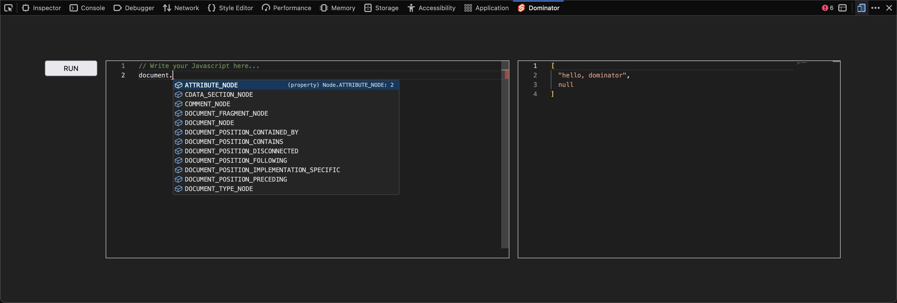

# Dominator

A firefox extension that

1. allow you to manipulate the dom tree inside the integrated monaco editor 
2. provides a facade `dominiator` object which expose the WebExtension API (check `lib.d.ts`)

